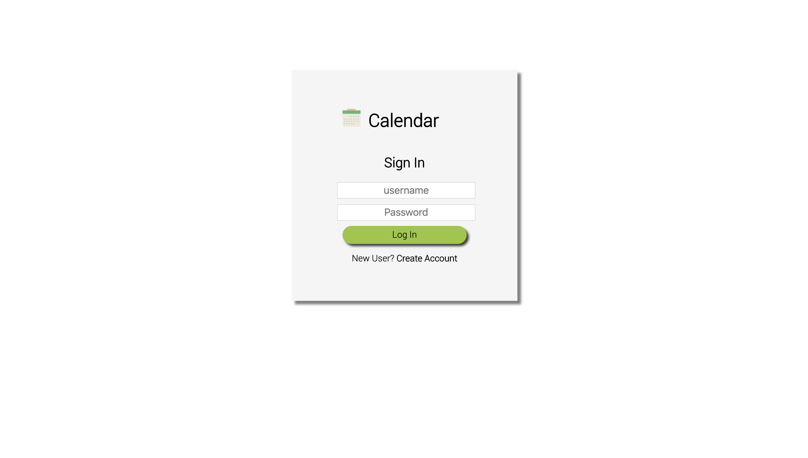
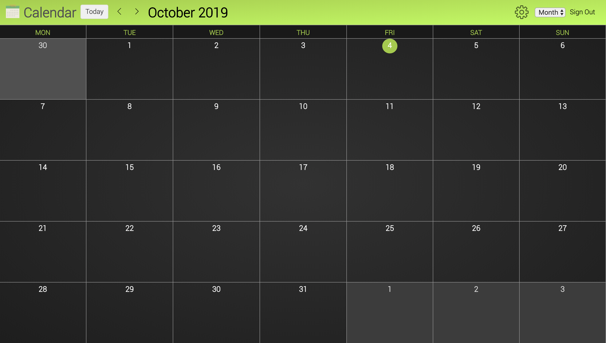
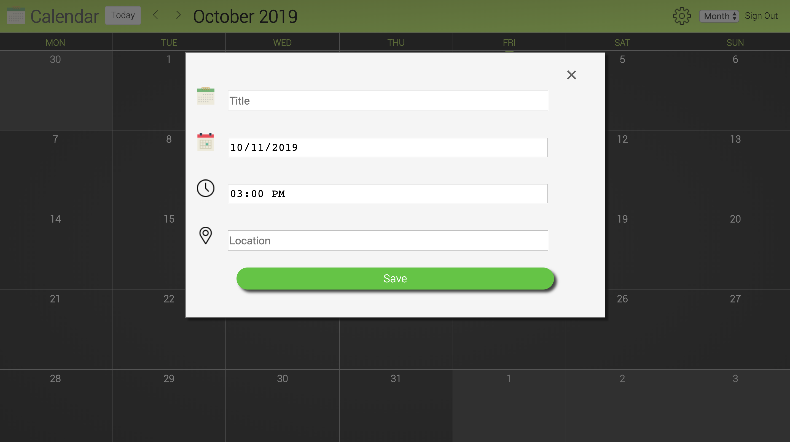

# Calendar
Simple calendar that supports viewing, adding, and deleting events. The website can be seen at the following link: http://ec2-18-222-239-18.us-east-2.compute.amazonaws.com/~pbishnupuri/mod5_group/calendar/
You can create a new account or you can use the the account name "test" with password "test" to login.

## Features
Added the following features to this project:
* Multiple Views: Added ability to support multiple views of the calender in addition to month view there is also week and day view.
* Monday/Sunday Selection: Allows calendar to begin on a Monday or a Sunday (useful for weekly habits).
* User setting preferences: Added a settings where the user can edit their preferences and that information gets persisted into the database.
* Location tag: Gave the option for the user to specify a location of the event.

## Screenshots
#### Login Screen

    

 

#### Home Screen

    

 

#### Add Event 

    

 